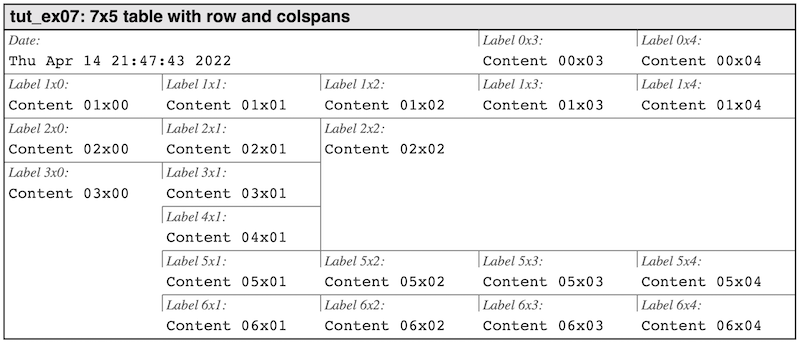
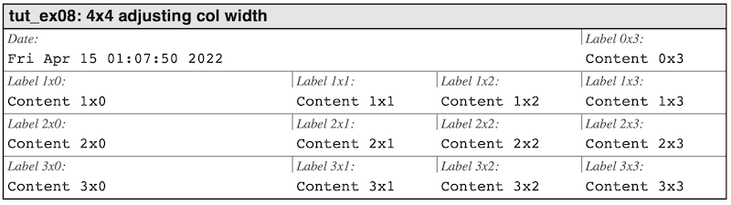

# Adjusting the layout of the table

The table can be modified both by adjusting the width of columns and how many rows and columns a cell is spanning.

## Cell and row spanning

A common way to modify a table is to have a cell spanning either multiple columns, multiple rows  or both. This is done using the function

```c
int
hpdftbl_set_cellspan(const hpdftbl_t tbl, 
                     size_t r, size_t c, 
                     size_t rowspan, size_t colspan)
```

The specified `(r,c)` is the row and column of the upper left cell in merged cell that spans `rowspan` rows and `colspans` columns. This is also the row and col coordinates used to accessing the combined cell.

To illustrate this we will create a table with seven rows and five columns. 
We will merge three cells using cell-spanning as follows:

```c
hpdftbl_set_cellspan(tbl, 0, 0, 1, 3);
hpdftbl_set_cellspan(tbl, 2, 2, 3, 3);
hpdftbl_set_cellspan(tbl, 3, 0, 4, 1);
```
For the data we will use the same setup as in @ref tut_ex06.c "tut_ex06.c"
This will then give the result shown in **Figure 8.**

    
***Figure 8:*** *Having cells spanning multiple rows and columns. @ref tut_ex07.c "tut_ex07.c"*

## Adjusting column width

By default, or column widths are divided equally regardless of the content. The width can be adjusted by explicitly set the relative width  of a column as a percentage of the total table width. This is done with the function

```c
int
hpdftbl_set_colwidth_percent(const hpdftbl_t tbl, 
                             const size_t c, 
                             const float w);
```

The width is set as a percentage of the total width and is specified as a floating point value in the range [0.0, 100.0]. An example of this is shown in **Figure 9.** below. An arbitrary number of columns can be given a width. For best result leave at least one column undefined and whatever remains of the table width will be assigned to that column. There is an error to try to specify a total column width > 100%.


     
***Figure 9:*** *Adjusting width of first columns. @ref tut_ex08.c "tut_ex08.c" *


