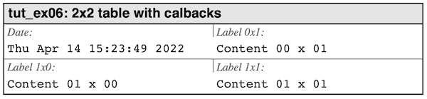

# Using callbacks {#sec_callbacks}

In the "[Getting started](GettingStarted.md)" chapter we discussed the preferred way to specify data and labels 
in table using data arrays. This is a very good way to populate a table in the cases the data is fairly static. 

For data that is more dynamic and determined at runtime it is of course possible to construct the data array 
but the table library have one better way to do this and that is to set up label and content callbacks.


## Introducing content callback functions
**Content callbacks** are functions that are called by the library for each cell and returns a 
string which is used as the data to be displayed. The signature for a cell content callback is defined by 
the type `hpdftbl_content_callback_t` which is a pointer to a function defined as:

```C
 typedef 
 char * (*hpdftbl_content_callback_t)(void *, size_t, size_t);
```
This signature is also used for label callbacks. For style setting callback the
signature is instead defined as

```c
typedef 
_Bool (*hpdftbl_content_style_callback_t)(void *, size_t, size_t, char *content, hpdf_text_style_t *);
```

To understand this lets start defining a callback function to specify content (or a label) that follows this signature.

```c
char *
my_cell_cb(void *tag, size_t row, size_t col) { ... }
```

The parameters in the callback are

| Parameter | Description                                                                                                                                                                                                                                                                                                                         |
|-----------|-------------------------------------------------------------------------------------------------------------------------------------------------------------------------------------------------------------------------------------------------------------------------------------------------------------------------------------|
| `tag`     | Since a callback sometimes must know from what table or in what circumstances it is called it is possible to add a "tag" to ech table. This could be something as simple as pointer to a numeric identifier that uniquely identifies the table or perhaps a pointer to some function that retrieves data for this particular table. |
| `row`     |  The cell row                                                                                                                                                                                                                                                                                                                              |
| `col`     |  The cell column                                                                                                                                                                                                                                                                                                                              |
    

It is possible to specify a callback to adjust content, style, and labels. 
A callback function can be specified to be used for every cell in the table 
or only for a specific cell. This can also be mixed in order to have, for example, one generic callback
for most cells and have a different callback for a specific cell. Any callback set for a cell
will override the callback set for the table

The API to specify these callbacks are:

| API                                   | Description                                                                                                                                                                                                                                           |
|---------------------------------------|-------------------------------------------------------------------------------------------------------------------------------------------------------------------------------------------------------------------------------------------------------|
| `hpdftbl_set_content_cb()`            | Specify a content callback for the entire table.                                                                                                                                                                                                      |
| `hpdftbl_set_content_style_cb()`      | Specify a style callback for the entire table.                                                                                                                                                                                                        |
| `hpdftbl_set_label_cb()`              | Specify a label callback for the entire table.                                                                                                                                                                                                        |
| `hpdftbl_set_cell_content_cb()`       | Specify callback for an individual cell. A cell callback will override<br/> a potential table callback.                                                                                                                                               |
| `hpdftbl_set_cell_content_style_cb()` | Specify a style callback for an individual cell. A cell callback will override<br/> a potential table callback.                                                                                                                                       |
| `hpdftbl_set_canvas_cb()`             | This is an advanced callback to allow for low level painting directly on the <br/>canvas that is the cell area arguments to the callback is different as it <br/> includes the bounding-box for th cell area. We will not further discuss this. |


@note **Returned content string**. The string pointer returned from a callback is never stored in the table. 
only printed. It is therefore perfectly possible to have a static allocated buffer in the callback function that is 
used to construct the content and returned from the callback.


## A content callback example

Let's now construct a simple example where the content and the labels are specified with callbacks. 

We will create callbacks that will add a date string to the top left cell and just som dummy content in the rest of the cells. 
We could do this in two ways. 

1. Add a generic table callback for all cells and then in that callback check if the row and column is (0,0) 
   i.e. top-left and in that case create a date.
2. Add a generic table callback for all cells and then add a specific cell callback with the date for the (0,0) cell.

To illustrate both methods we will use method 1 for the labels and method 2 for the content.

Let's first create the date callback functions we need to add a date in the top left corner of the
table that reflects the current date and time.

```c
static char *
cb_date(void *tag, size_t r, size_t c) {
    static char buf[64];
    time_t t = time(NULL);
    ctime_r(&t, buf);
    return buf;
}
```

This would be sufficient for normal usage. However, the source code in @ref tut_ex06.c that illustrates callbacks is 
slightly different:

@dontinclude tut_ex06.c

@skip static
@until }
@until }
@until }


The reason for this is that all these examples also serve as unit tests for the library. The way the unit tests 
work is by comparing the output from all these examples with stored, manually checked "correct" versions of the
output. Since any date changes will make the file different we must make the dates a known value whe the 
examples are run as unit teets. This we know when the flag `run_as_unit_test` is true and in that case
a "dummy" static date is used.

The content and label functions can then be written as follows

```c
static char * cb_content(void *tag, size_t r, size_t c) {
    static char buf[32];
    snprintf(buf, sizeof buf, "Content %02zu x %02zu", r, c);
    return buf;
}

static char * cb_labels(void *tag, size_t r, size_t c) {
    static char buf[32];
    if (0==r && 0==c) { // Top-left cell
        snprintf(buf, sizeof buf, "Date:");
    } else {
        snprintf(buf, sizeof buf, "Label %zux%zu:", r, c);
    }
    return buf;
}
```

We note that we ignore the tag argument. Since we only have one table there is no need to use a tag to different 
from which table the callback comes.

For the table structure we will re-use our previous example and create a 2x2 table, and we get the 
following table creation code:

@dontinclude tut_ex06.c

@skip ex06
@until }

Running this example gives the result shown in **Figure 7.**  below, the full source code can be found in @ref tut_ex06.c

   

***Figure 7:*** *Using callbacks to populate the table and labels.*


## Dynamic (late binding) callbacks

@warning This is an advanced concept and while simple in theory it does
have some hidden "gotchas".

All callback functions discussed above must exist att compile time so that the
address of the functions can be determined by the compiler. As we will discuss 
later it is possible to define a table as a data structure to avoid having to
write several lines of code in defining a table.

Such a data structure could in theory be stored in a database or as a text file.
In that case it will not be possible to specify a callback function since the
address of function is determined at link time.

Fortunately it is possible to specify a function name (as a string) and have
the standard C-library locate where that function is stored and return a 
pointer to it. This pointer is then the same as if the callback had been
bound at compile time.

There is a analog set of functions that takes a string name of the function
and looks up the actual function pointer and set that as the callback.

Those analogue functions are

| API                                    | Description                      |
|----------------------------------------|----------------------------------|
| hpdftbl_set_dlhandle()                 | Option to set dynamic lib handle |
| hpdftbl_set_content_dyncb()            | Table content late binding       |
| hpdftbl_set_label_dyncb()              | Table label late binding         |
| hpdftbl_set_cell_label_dyncb()         | Table cell label latex binding   |
| hpdftbl_set_content_style_dyncb()      | Table style late binding         |      
| hpdftbl_set_cell_content_style_dyncb() | Table cell content late binding  |
| hpdftbl_set_cell_canvas_dyncb()        | Cell canvas callback             |

They are identical to hhe already described "ordinary" setting callback functions
with the difference these functions take a string as argument rather than a 
function pointer.


### Using late binding

Using late binding is very similar to what we did in the previous examples, 
We start by defining the callback functions we need

@dontinclude tut_ex30.c

@skip char
@until cb_labels
@until return
@until }


It is however one crucial detail that cannot be overlooked. **None of the callbacks functions can be static!** If they are static they won't be found

Then it is really simple. We create the table with the function that should now be familiar and
then add the callbacks with the names of the callback functions as so

@skip hpdftbl_set_content_dyncb
@until hpdftbl_set_cell_content_dyncb

In this way it is possible to specify the entire table structure as a  text structure
that could be stored in a database or as a text file with just the name of the callback
functions. However, care must be taken that they are named exactly as they are specified.

The complete table function is shown below and the full example be found in @ref tut_ex30.c 

@dontinclude tut_ex30.c

@skip Table 30
@skip void
@until }

### Late binding, serialization and compiler flag

One of the areas that will force the use of late binding is serialization. If a table is serialized (to JSON) then
the only option is to store callback functions as names that will be written in the JSON data object.

When reading back a serialized table it is of course necessary for there to a callback function with the
exact same name in the program. 

Unfortunately, depending on the architecture being developed on this might not be sufficient for the library to
find and resolve the function.  

On **OSX** this works out of the box as all symbols are exported.
On **Linux** however, the linker  flag `-rdynamic` have to be added in the linker step. This flag forces all 
symbols  to the dynamic symbol table.  The dynamic symbol table is the set of symbols which are visible from dynamic 
objects at run time. Another way to describe the effect of `-rdynamic` is that symbols are only exported by 
default from shared libraries. `-rdynamic` tells linker to do the same for executables.

Note: On OSX all symbols are exported by `clang` so this flag is not necessary (but does no harm).