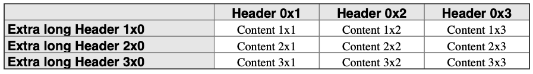

# Font and style setting {#ch_styleandfontsetting}

The format of each cell can be adjusted with respect to:

1. Font-family and style (size, bold, italic etc.)
2. Font- and background-color
3. Border thickness and color

In this section we will focus on how to adjust the font and background color. The style can be adjusted both for the entire table at once and also for individual cells. The individual cell style will always override the table cell style. 

The primary API to adjust the table style are:

```c
// Set background color for entire table
int hpdftbl_set_background(hpdftbl_t t, 
                           HPDF_RGBColor background);

// Set label style for the entire table
int hpdftbl_set_label_style(hpdftbl_t t,
                            char *font, HPDF_REAL fsize,
                            HPDF_RGBColor color, HPDF_RGBColor background);

// Set content style for entire table
int hpdftbl_set_content_style(hpdftbl_t t, 
                              char *font, HPDF_REAL fsize, 
                              HPDF_RGBColor color, HPDF_RGBColor background);

// Set content style for specified cell
int hpdftbl_set_cell_content_style(hpdftbl_t t, 
                                   size_t r, size_t c, 
                                   char *font, HPDF_REAL fsize, 
                                   HPDF_RGBColor color, HPDF_RGBColor background);

// Set content style for specified row in table
int hpdftbl_set_row_content_style(hpdftbl_t t, 
                                  size_t r, 
                                  char *font,  HPDF_REAL fsize, 
                                  HPDF_RGBColor color, HPDF_RGBColor background);

// Set content style for specified column in table
int hpdftbl_set_col_content_style(hpdftbl_t t, 
                                  size_t c, 
                                  char *font,  HPDF_REAL fsize,
                                  HPDF_RGBColor color, HPDF_RGBColor background);
```

## Adjusting fonts and colors {#sec_specifyingfontsandcolors}

Fonts are specified as a string with the type font family name as recognized by the core Haru PDF library, e.g. "Times-Roman", "Times-Italic",  "Times-Bold" etc. As a convenience not to have to remember the exact font name strings the following three font family are defined as `HPDF_FF_*` where the last part of the name is specified as the following table shows

| Font family | Italic             | Bold             | BoldItalic             |
|-------------|--------------------|------------------|------------------------|
| `TIMES`     | `TIMES_ITALIC`     | `TIMES_BOLD`     | `TIMES_BOLDITALIC`     |
| `HELVETICA` | `HELVETICA_ITALIC` | `HELVETICA_BOLD` | `HELVETICA_BOLDITALIC` |
| `COURIER`   | `COURIER_ITALIC`   | `COURIER_BOLD`   | `COURIER_BOLDITALIC`   |

***Table 1:*** *Predefined font family and variants*

So to use the "Helvetic" font family the constant `HPDF_FF_HELVETICA` is used and so on.

Colors are specified in the standard Haru way, i.e. as an instance of the structure `HPDF_RGBColor`. As another convenience the following colors are predefined

```c
#define HPDF_COLOR_DARK_RED      (HPDF_RGBColor) { 0.6f, 0.0f, 0.0f }
#define HPDF_COLOR_RED           (HPDF_RGBColor) { 1.0f, 0.0f, 0.0f }
#define HPDF_COLOR_LIGHT_GREEN   (HPDF_RGBColor) { 0.9f, 1.0f, 0.9f }
#define HPDF_COLOR_GREEN         (HPDF_RGBColor) { 0.4f, 0.9f, 0.4f }
#define HPDF_COLOR_DARK_GREEN    (HPDF_RGBColor) { 0.05f, 0.37f, 0.02f }
#define HPDF_COLOR_DARK_GRAY     (HPDF_RGBColor) { 0.2f, 0.2f, 0.2f }
#define HPDF_COLOR_LIGHT_GRAY    (HPDF_RGBColor) { 0.9f, 0.9f, 0.9f }
#define HPDF_COLOR_XLIGHT_GRAY   (HPDF_RGBColor) { 0.95f, 0.95f, 0.95f }
#define HPDF_COLOR_GRAY          (HPDF_RGBColor) { 0.5f, 0.5f, 0.5f }
#define HPDF_COLOR_SILVER        (HPDF_RGBColor) { 0.75f, 0.75f, 0.75f }
#define HPDF_COLOR_LIGHT_BLUE    (HPDF_RGBColor) { 1.0f, 1.0f, 0.9f }
#define HPDF_COLOR_BLUE          (HPDF_RGBColor) { 0.0f, 0.0f, 1.0f }
#define HPDF_COLOR_DARK_BLUE     (HPDF_RGBColor) { 0.0f, 0.0f, 0.6f }
#define HPDF_COLOR_WHITE         (HPDF_RGBColor) { 1.0f, 1.0f, 1.0f }
#define HPDF_COLOR_BLACK         (HPDF_RGBColor) { 0.0f, 0.0f, 0.0f }
```

So for example to set the overall default font to 12pt Times Roman with black text on white bottom the following call must be made

```c 
...
hpdftbl_set_content_style(tbl, HPDF_FF_TIMES, 12, HPDF_COLOR_BLACK, HPDF_COLOR_WHITE);
...
```

Since RGB for colors are specified as a floating point number in range [0.0, 1.0] and most color tables give colors as 
an integer triple there is exists a macro to make this conversion easier

```c
#define HPDF_RGB_CONVERT(r,g,b) (HPDF_RGBColor){r/255.0,g/255.0,b/255.0} 
```

which will allow the easier specification of color such as 

```c
#define HPDF_COLOR_ORANGE              HPDF_RGB_CONVERT(0xF5, 0xD0, 0x98);
#define HPDF_COLOR_ALMOST_BLACK        HPDF_RGB_CONVERT(0x14, 0x14, 0x14);
```

## Using style callbacks

In much the same way as callbacks can be used for specifying content and labels so can a callback be used to specify the style of a cell or the entire table.


A style callback has the following signature

```c
_Bool 
hpdftbl_content_style_callback_t(void *tag, size_t r, size_t c, char *content, hpdf_text_style_t *style);
```
In order for the settings to be applied the callback has to return a  boolean `TRUE` value. 

If the callback returns `FALSE` the settings will **not** be applied.

The parameters are used as follows:
- The `tag` parameter has the same meaning as for content and label callbacks; an optional unique identifier for the table.** The `tag` parameter should always be checked for possible `NULL` value since it is not required for a table to have a tag.
- The `r` and `c` arguments are the row and column of the cell the callback is made for
- The `content` is the cell content string. The rationale for including this in the style callback is to allow for highlighting in the table of specific data. It could for example be something as simple as wanting to mark all values above a certain threshold with another background color in the table to draw attention.
- Finally, the actual style is encompassed by the `hpdf_text_style_t` and is defined as the following structure   
    ```c
    typedef struct text_style {
        char *font;                     /**< Font face name */
        HPDF_REAL fsize;                /**< Font size */
        HPDF_RGBColor color;            /**< Font color */
        HPDF_RGBColor background;       /**< Font background color */
        hpdftbl_text_align_t halign;    /**< Text horizontal alignment */
    } hpdf_text_style_t;
    ```

The style callbacks can exactly as the content callback be specified for either the entire table or for a specific cell. A cell callback will always override a table callback. The two functions to set up style callbacks are

```c
int
hpdftbl_set_cell_content_style_cb(hpdftbl_t tbl, 
                                  size_t r, size_t c, 
                                  hpdftbl_content_style_callback_t cb);

int
hpdftbl_set_content_style_cb(hpdftbl_t tbl, 
                             hpdftbl_content_style_callback_t cb);
```

@note Due to som technicalities **the style callbacks are called twice** per cell. The first call is necessary to set up the background canvas and at that stage the content is not necessarily known since it could be later specified with a content callback. The first time the callback is made the `content` parameter is always guaranteed to be `NULL`

### Style callback example

An example of a callback function to set a background color for a header row/column for a table could for example be done as follows

```c
_Bool
cb_style(void *tag, size_t r, size_t c, char *content, hpdf_text_style_t *style) {
    // Format the header row/column with a grey background and Helvetica font while the rest of the
    // table uses "Times Roman"
    if( 0==r || 0==c ) { // Headers
        style->font = HPDF_FF_HELVETICA_BOLD;
        style->fsize = 12;
        style->color = HPDF_COLOR_BLACK;
        style->background = HPDF_COLOR_LIGHT_GRAY;
        if ( c > 0 )
            style->halign = CENTER;
        else
            style->halign = LEFT;
    } else { // Content
        style->font = HPDF_FF_TIMES;
        style->fsize = 11;
        style->color = HPDF_COLOR_BLACK;
        style->background = HPDF_COLOR_WHITE;
        style->halign = CENTER;
    }
    return TRUE;
}
```

and the table setup code can then be written as

```c
void
create_table_ex09(HPDF_Doc pdf_doc, HPDF_Page pdf_page) {
    const size_t num_rows = 4;
    const size_t num_cols = 4;

    hpdftbl_t tbl = hpdftbl_create(num_rows, num_cols);

    hpdftbl_set_content_cb(tbl, cb_content);
    hpdftbl_set_content_style_cb(tbl, cb_style);

    hpdftbl_set_colwidth_percent(tbl, 0, 40);

    HPDF_REAL xpos = hpdftbl_cm2dpi(1);
    HPDF_REAL ypos = hpdftbl_cm2dpi(A4PAGE_HEIGHT_CM - 1);
    HPDF_REAL width = hpdftbl_cm2dpi(A4PAGE_WIDTH_CM - 4);
    HPDF_REAL height = 0;  // Calculate height automatically

    hpdftbl_stroke(pdf_doc, pdf_page, tbl, xpos, ypos, width, height);
}
```

The resulting table is shown in **Figure 10.** below.

  
***Figure 10:*** *Using a style callback to highlight header rows & columns.* *@ref tut_ex09.c "tut_ex09.c"*

 
## Using style themes {#sec-themes}

A theme (or style theme) is a definition of the "look & feel" of a table. It doesn't affect the structure of the table
such as the size of the table or how many columns or rows a cell spans. It is practical shortcut
when many tables should be displayed in the same style. It allows the compact specification
of the table by applying a theme to the table instead of having to call multiple functions to
achieve the same thing. In addition, if the design should be changed there is only one place to
update instead of for each table.

@note There is not yet any support to read and write themes from a file. A theme is therefor
an *in memory* structure useful within one program.

A theme controls the following aspects of a table

- The content and label text style
- The header and title text style
- The inner and outer border style
- The usage (or not) of labels and whether the shorter label grind lines should be used
- If a header row should be used or not
- If a title should be used or not


if you have multiple table in a document it is possible to create a *table theme* which consists of some core styling 
of a table that can be reused. 

All information for a theme is encapsulated in the hpdftbl_theme structure.

This structure can be set up manually and then applied to a table. However, the recommended way is to first 
use the "theme getter" function to get the default theme and then modify this default theme as needed since
it allows you to only have to update the parts affected by a change.

The functions to work with a theme are :

| API                                                                    | Description                                          |
|------------------------------------------------------------------------|------------------------------------------------------|
| `int` <br/> `hpdftbl_apply_theme(hpdftbl_t t, hpdftbl_theme_t *theme)` | Apply the given theme to a table                     |
| `hpdftbl_theme_t *` <br/> `hpdftbl_get_default_theme(void)`            | Get the default theme into a new allocated structure |
| `int` <br/> `hpdftbl_destroy_theme(hpdftbl_theme_t *theme)`            | Free the memory used by a theme                      |


@note It is the responsibility of the user of the library to destroy the theme structure by ensuring that `hpdftbl_destroy_theme()` is called when a theme goes out of scope.

The default font styles for the default theme are shown in table 1. 

| Style   | Font                   | Size | Color     | Background | Alignment | 
|---------|------------------------|------|-----------|------------|-----------|
| content | HPDF_FF_COURIER        | 10   | Black     | White      | Left      |
| label   | HPDF_FF_TIMES_ITALIC   | 9    | Dark gray | White      | Left      |
| header  | HPDF_FF_HELVETICA_BOLD | 10   | Black     | Light gray | Center    |
| title   | HPDF_FF_HELVETICA_BOLD | 11   | Black     | Light gray | Left      |

***Table 1:*** *Default font styles.* 

&nbsp;

| Theme parameter      | Default value |
|----------------------|---------------|
| use_labels           | FALSE         |
| use_label_grid_style | FALSE         |
| use_header_row       | FALSE         |

***Table 2:*** *Default table structure parameters.* 

&nbsp;

| Border       | Color     | Width (pt) |
|--------------|-----------|------------|
| inner_border | Grey      | 0.7        |
| outer_grid   | Dark Grey | 1.0        |

***Table 3:*** *Default border parameters.* 


## Adjusting grid line styles {#sec_borderstyles}

There are four distinct set of grid lines as far as the library is concerned. 

1. The outer gridlines (or border) around the table, and
2. The inner vertical grid line 
3. The inner horizontal grid line
4. The inner top grid line (not the outer border!)

All these types of gridlines are styled in the same way using the functions

```c
int
hpdftbl_set_inner_tgrid_style(hpdftbl_t t, 
                              HPDF_REAL width, HPDF_RGBColor color,hpdftbl_line_dashstyle_t dashstyle);

int
hpdftbl_set_inner_vgrid_style(hpdftbl_t t, 
                              HPDF_REAL width, HPDF_RGBColor color, hpdftbl_line_dashstyle_t dashstyle);

int
hpdftbl_set_inner_hgrid_style(hpdftbl_t t, 
                              HPDF_REAL width, HPDF_RGBColor color, hpdftbl_line_dashstyle_t dashstyle);

int
hpdftbl_set_inner_grid_style(hpdftbl_t t, 
                             HPDF_REAL width, HPDF_RGBColor color, hpdftbl_line_dashstyle_t dashstyle);
```

Each type of gridlines can be adjusted with line width, color and style. 
The last function in the list, hpdftbl_set_inner_grid_style(), is a convenience function that sets both
the vertical and horizontal inner lines in one call.

The table below illustrates the various dashed line styles available and their names.
See also @ref hpdftbl_dashstyle
and grid style functions
@ref hpdftbl_set_inner_grid_style(),
@ref hpdftbl_set_inner_vgrid_style() and
@ref hpdftbl_set_inner_hgrid_style()

| Dash Style    | Illustration                              |
|---------------|-------------------------------------------|
| LINE_SOLID    | @image html screenshots/line_solid.png    |
| LINE_DOT1     | @image html screenshots/line_dot1.png     |
| LINE_DOT2     | @image html screenshots/line_dot2.png     |
| LINE_DOT3     | @image html screenshots/line_dot3.png     |
| LINE_DOT4     | @image html screenshots/line_dot4.png     |
| LINE_DASH1    | @image html screenshots/line_dash1.png    |
| LINE_DASH2    | @image html screenshots/line_dash2.png    |
| LINE_DASH3    | @image html screenshots/line_dash3.png    |
| LINE_DASH4    | @image html screenshots/line_dash4.png    |
| LINE_DASH5    | @image html screenshots/line_dash5.png    |
| LINE_DASHDOT1 | @image html screenshots/line_dashdot1.png |
| LINE_DASHDOT2 | @image html screenshots/line_dashdot2.png |


The following example (@ref tut_ex20.c "tut_ex20.c" ) makes use of these settings as shown below

```c
void
create_table_ex20(HPDF_Doc pdf_doc, HPDF_Page pdf_page) {
    const size_t num_rows = 5;
    const size_t num_cols = 4;

    hpdftbl_t tbl = hpdftbl_create(num_rows, num_cols);
    content_t content;

    setup_dummy_content(&content, num_rows, num_cols);
    hpdftbl_set_content(tbl, content);

    hpdftbl_set_inner_vgrid_style(tbl, 0.7, HPDF_COLOR_DARK_GRAY, LINE_SOLID);
    hpdftbl_set_inner_hgrid_style(tbl, 0.8, HPDF_COLOR_GRAY, LINE_DOT1);
    hpdftbl_set_inner_tgrid_style(tbl, 1.5, HPDF_COLOR_BLACK, LINE_SOLID);
    hpdftbl_set_outer_grid_style(tbl, 1.5, HPDF_COLOR_BLACK, LINE_SOLID);

    HPDF_REAL xpos = hpdftbl_cm2dpi(1);
    HPDF_REAL ypos = hpdftbl_cm2dpi(A4PAGE_HEIGHT_CM - 1);
    HPDF_REAL width = hpdftbl_cm2dpi(10);
    HPDF_REAL height = 0;  // Calculate height automatically

    // Stroke the table to the page
    hpdftbl_stroke(pdf_doc, pdf_page, tbl, xpos, ypos, width, height);
}
```

and when run will result in the following table:

@image html screenshots/tut_ex20.png

@image latex screenshots/tut_ex20.png width=8cm

## Adding zebra lines in a table

A common way to make it easier to read a table is to make every other row a different color. 
This is sometimes known as zebra lines (or rows). This can be easily accomplished in the
library by using the functions

```c
int
hpdftbl_set_zebra(hpdftbl_t t, _Bool use, int phase);

int
hpdftbl_set_zebra_color(hpdftbl_t t, HPDF_RGBColor z1,  HPDF_RGBColor z2);
```

The first function is used to enable/disable row coloring and the second to set the first
and second color. The `phase` parameter determines if color 1 is used first or is color 2
is used on the first row. Setting phase tom0 will make the first row use color 1 as background.

The default color are white and light gray. The following example 
( @ref tut_ex15.c "tut_ex15.c" ) shows how this can be
done:

```c
void
create_table_ex15(HPDF_Doc pdf_doc, HPDF_Page pdf_page) {
    const size_t num_rows = 7;
    const size_t num_cols = 5;

    hpdftbl_t tbl = hpdftbl_create(num_rows, num_cols);

    content_t content;
    setup_dummy_content(&content, num_rows, num_cols);
    hpdftbl_set_content(tbl, content);

    hpdftbl_set_zebra(tbl, TRUE, 1);

    HPDF_REAL xpos = hpdftbl_cm2dpi(1);
    HPDF_REAL ypos = hpdftbl_cm2dpi(A4PAGE_HEIGHT_CM - 1);
    HPDF_REAL width = hpdftbl_cm2dpi(18);
    HPDF_REAL height = 0;  // Calculate height automatically

    // Stroke the table to the page
    hpdftbl_stroke(pdf_doc, pdf_page, tbl, xpos, ypos, width, height);
}
```

Running this example will give the following result

@ref tut_ex15.c "tut_ex15.c"

@image html screenshots/tut_ex15.png
@image latex screenshots/tut_ex15.png width=15cm

We can make a small modification by setting `phase` = 1 (instead of the default 0) to start
with color2. In addition, we can adjust the inner horizontal gridlines to have the same 
extra light gray as the zebra line making them "invisible" by modifying the table setup as 
follows (@ref tut_ex15_1.c "tut_ex15_1.c").

```c
void
create_table_ex15(HPDF_Doc pdf_doc, HPDF_Page pdf_page) {
    const size_t num_rows = 7;
    const size_t num_cols = 5;

    hpdftbl_t tbl = hpdftbl_create(num_rows, num_cols);

    content_t content;
    setup_dummy_content(&content, num_rows, num_cols);
    hpdftbl_set_content(tbl, content);
    //hpdftbl_use_header(tbl, TRUE);

    hpdftbl_set_zebra(tbl, TRUE, 1);

    // Normal inner line (same color as default Zebra to make them "invisible"
    hpdftbl_set_inner_hgrid_style(tbl, 0.5, HPDF_COLOR_XLIGHT_GRAY,LINE_SOLID );

    // Top inner line. Comment this line to get a visible top line
    hpdftbl_set_inner_tgrid_style(tbl, 0.5, HPDF_COLOR_XLIGHT_GRAY,LINE_SOLID );

    HPDF_REAL xpos = hpdftbl_cm2dpi(1);
    HPDF_REAL ypos = hpdftbl_cm2dpi(A4PAGE_HEIGHT_CM - 1);
    HPDF_REAL width = hpdftbl_cm2dpi(18);
    HPDF_REAL height = 0;  // Calculate height automatically

    // Stroke the table to the page
    hpdftbl_stroke(pdf_doc, pdf_page, tbl, xpos, ypos, width, height);
}
```

Running this gives the following result:

@ref tut_ex15_1.c "tut_ex15_1.c"

@image html screenshots/tut_ex15_1.png
@image latex screenshots/tut_ex15_1.png width=15cm

@note Another way to hide a gridline is to set its width to 0

