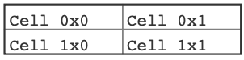
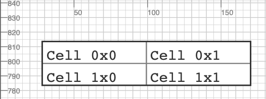
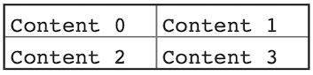
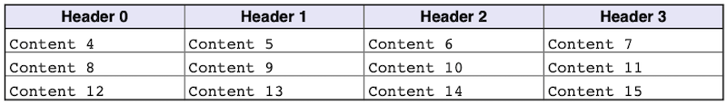
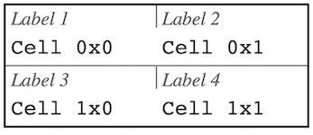
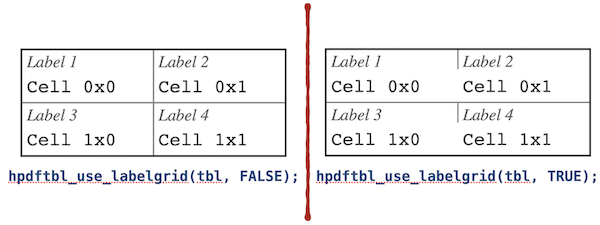
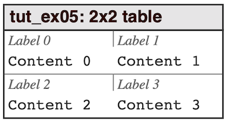

# Getting started

In this section we will introduce the basic usage of the 
`hpdftbl` library. We will start simple and work us all the way to
complex tables and explain what is happening as we go along.

We will not assume any knowledge of the table library, but **we will assume
that you are familiar with the plain Haru PDF library**.

## Creating an infrastructure for the examples

Before we start creating a
table we need to set up a plain PDF page with the core HPDF library. The HPDF library 
has excellent documentation on how to do this, and we will use the same basic setup for
all our examples. We will create a document in A4 size that have one page that will
be written to a file whose name is taken from the program arguments. For this
we use a few utility functions and our `main()` will always have the following structure:

```c
int
main(int argc, char **argv) {
    
    HPDF_Doc pdf_doc;
    HPDF_Page pdf_page;

    if (setjmp(_hpdftbl_jmp_env)) {
        HPDF_Free(pdf_doc);
        return EXIT_FAILURE;
    }

    setup_hpdf(&pdf_doc, &pdf_page, FALSE);
    create_table_<EXAMPLE NAME>(pdf_doc, pdf_page);

    if( -1 == stroke_to_file(pdf_doc, argc, argv) )
        return EXIT_FAILURE;
   else
        return EXIT_SUCCESS;
}
```

In order to make the example code consistent and focused on the table library and not on the general
creating of PDF document we will include the supporting Haru set-up code in an include file and instead 
of the `main()` function shown above we will replace it with a macro with one parameter; the table function
to be called to set-up the table example (see TUTEX_MAIN()).

All our example code will therefore be a fully standalone programs but structured in way not to obscure the
actual table creation with a lot of boiler-plate PDF set-up code. All tutorial example programs `tut_ex<nn>` will 
therefore have the following general structure: 

```c
#include "unit_test.inc.h"
 
void
create_table_XXXX(HPDF_Doc pdf_doc, HPDF_Page pdf_page) {
    ...
}

TUTEX_MAIN(create_table_XXXX, FALSE)
```

The second argument to the TUTEX_MAIN() macro determines if the example should be generated with
gridlines on the paper. This is useful for precisely position the table on a page.

In the `examples` directory the full source code for the setup and stroke functions can be found
in all the tutorial examples, for example @ref tut_ex01.c "tut_ex01.c".
They are very basic and follows the standard hpdf library methodology. The `setup_hpdf()` 
creates a new document wth one A4 page and the `stroke_to_file()` strokes the document 
to an output file which depends on the program argument.

@note If any of the test programs are run without any arguments the output file will
be stored in the `out` directory and have the same name as the basename of the 
program with a "*.pdf" suffix. If exactly one filename is specified as an argument then
this is the file the output will be written to.

In the following we will focus only on the `create_table_<NAME_OF_EXAMPLE>()` function which 
will use the two parameters `pdf_doc` and `pdf_page` to refer to the document and page to
construct the table.

@note In order to make the examples robust and compatible with both Windows and Linux/OSX systems 
some conditional compilation instructions are also used, but we will not display them while discussing 
the basic usage to keep the focus on what matters. 

The full source for all example are available in the `examples/` directory as well as in the 
@ref examples "Examples" section of this manual.

&nbsp;

## Your first table

@ref tut_ex01.c "tut_ex01.c"

The first example shows the absolute most basic usage. We create a 2x2 table in steps as follows.
We will follow the framework oulined above. Our first example is tut_ex01.c

First we construct a table handle for a 2x2 table

@dontinclude{} tut_ex01.c

@skip create
@until tbl

Here we note that:
- The size of the table has to be determined before the table handle is created
- All table function will refer to this handle, and we will always use the variable name `tbl` for this handle
- We use `size_t` instead of `int` since the table dimension is a size and as such can never be negative. In C it is 
  always good practice to use `size_t` for positive numeric entities.

Once we have the table handle we can start to add content in these cells. For now lets just put a string that 
indicates the cells position.

@skip Cell 0x0
@until Cell 1x1

Here we note that: 

- Cells are referred to starting from the top left cell that is cell (0x0).
- The `NULL` argument (4th argument) will be explained shortly.

Now It's time to size and position the table on the page. As a minimum you must specify the `x` and `y` position as well as the width of the table. The library is smart enough to automatically figure out the height (but it is also possible to force a larger height than strictly necessary either by specifying an overall table height or a minimum row height using hpdftbl_set_min_rowheight())

The native coordinate system for PDF pages are given as the printing unit of DPI or *dots per inch*. By default, the resolution of a PDF is 72 DPI. 

To make it easier to directly set the size and position in centimeters a convenience function `hpdftbl_cm2dpi()` can be used. 

@note For precision positioning it is more accurate to give the position and sizes in dots directly. 

In this example we set the size and position in centimeters. The paper coordinate system has its origin in the lower left corner of the paper.
We position the top left of the table *1 cm* below and *1 cm* to the right of the top left corner of the paper. To make this easier we make use of the constant `A4PAGE_HEIGHT_CM` and make the table *5 cm* wide as follows:

@skip xpos
@until height


Now, there are several important observations to be made here:

- The origin of the paper coordinate system is bottom left which is (0,0)
- The anchor position by default is the top-left corner of the table (this can be adjusted by calling `hpdftbl_set_anchor_top_left(FALSE)` function which will make the bottom left the anchor point instead)
- We use a predefined constant `A4PAGE_HEIGHT_IN_CM` to position the table vertically 1 cm from the top of the paper
- We let the library calculate the minimum table height automatically (based on the font height used in the table)

Now the only thing remaining is to print or stroke the table to the page and use the macro to 
create a main function TUTEX_MAIN() as follows:

@skip stroke
@until TUTEX_MAIN

and we are done!

If we put it all together it will give us the following basic table creation code

@include{lineno} tut_ex01.c

The generated table is shown in **Figure 1.** (@ref tut_ex01.c "tut_ex01.c")

  
***Figure 1:*** *Your first table.*

As we explained above the coordinate system is in postscript dots. For precision positioning it might be useful to visualize this grid on the page. By using the `hpdftbl_stroke_grid()` function such a grid can be displayed on a page to help with positioning. 

In our infrastructure set-up this call is controlled by setting the secon macro parameter to `TRUE`, i.e. 
`TUTEX_MAIN(create_table_ex01, FALSE)`

If we add the grid to the page and show the upper left area of the paper with the grid we can view its positioning in the grid as shown in **Figure 2.**

  
***Figure 2:*** *Your first table in the page coordinate system showing the upper left part of the paper.*

Since this is an A4 page it will have a height of roughly 841 points or 29.7cm. In our setup it is possible to generate thegrid by setting
the third argument to setup_hpdf() to `TRUE`. This can be done by updating the TUTEX_MAIN() macro 

## Your second table - disconnecting program structure from data

One drawback of the program in the first example above is that if we want to have a different
table size we need to actually change the code since we need one function call to store the data to be displayed in each cell. Wouldn't it be better if we could just supply an array with the data we want to display?

The function to do just that is

```C
hpdftbl_set_content(hpdftbl_t tbl, char **content)
```

The content data is a 1-dimensional array of string pointers. Where each row is consecutive in the array. For example to create dummy data indicating what array position goes into what cell you could use the following setup:


@note We allocate each string dynamically in the dummy-data and since the program is just an illustration and terminates after the page has been created we never bother to free this memory. In a real life scenario this would of course be crucial!

We could then augment example 01 using this more efficient way to specify data as so:

@dontinclude tut_ex02.c
@skip ex02
@until }

@ref tut_ex02.c "tut_ex02.c"

Running the code above in our infrastructure will give

  
***Figure 3:*** *Specifying data in a table with an array of string pointers.(@ref tut_ex02.c "tut_ex02.c")*

In the above (small) example it might not have been a big safe but if you have a table with 20x10 rows * cols then you will soon appreciate this way of specifying data. 

There is even one more way of specifying data that in some situations are more efficient and allows a clear division between the table structure and look&feel and its data. This more efficient way is achieved by using cell callbacks either directly in individual cells or in one go by specifying the entire table as a data structure by using the `hpdftbl_stroke_from_data()` function. This will be described later when we discuss how to use callback functions.

But now it is time to explain the `NULL` value in the first example when we specified the content with the `hpdftbl_set_cell()` function.

## Adding a header row

While it is possible (as discussed in section @ref ch_styleandfontsetting "Style and font setting" and @ref sec_specifyingfontsandcolors "Fonts and Colors"  ) to manually adjust the font, size, style, background etc. on each cell individually there is a convenient shortcut to create a basic table with a header using the `hpdftbl_use_header()` function. By modifying the code above and add this line we get the following code and resulting table

@dontinclude tut_ex02_1.c
@skip ex02_1
@until }


The resulting table can be seen in **Figure 4**. 
We also modified the dummy data to have the work "Header" text for `row==0` in the first row 
(for details see @ref tut_ex02_1.c "tut_ex02_1.c" )

  
***Figure 4:*** *Adding automatic header formatted row (@ref tut_ex02_1.c "tut_ex02_1.c")*


## Using labels in the table cells

A variant of a table is to present data with a short label describing what kind of data is displayed. 
This is often used when a table is used to present a data form. An example of this is shown in **Figure 4.** below.

  
***Figure 4:*** *Specifying labels for each cell. (@ref tut_ex03.c "tut_ex03.c")*

Adding labels requires three things:

1. Enable the "label" feature with a call to `hpdftbl_use_labels(tbl, TRUE);`
2. Add the text that should be the label. Specifying these labels can either be done using the `hpdftbl_set_cell()` function as in

     ```C
     hpdftbl_set_cell(tbl, 0, 0, "Label 1", "Cell 0x0");
     hpdftbl_set_cell(tbl, 0, 1, "Label 2", "Cell 0x1");
     hpdftbl_set_cell(tbl, 1, 0, "Label 3", "Cell 1x0");
     hpdftbl_set_cell(tbl, 1, 1, "Label 4", "Cell 1x1");
     ```  
    or it can be done using the analog of specifying the labels in an array using the function `hpdftbl_set_labels()`.

3. In addition, there is one more key setting and that is whether the left cell border should be the whole cell 
or just the table height as was shown in **Figure 4.** above. This option is specified with ` hpdftbl_use_labelgrid()`. 
4. By default, the left border is from top to bottom. The differences between the two variants is shown in **Figure 5.** below.  
  
***Figure 5:*** *The two variants of left cell border with labels.*

@note Except for the simplest of tables both the table content and the labels should be specified in an array.

To create dummy date for both content and labels we use the function setup_dummy_content_label()

@dontinclude unit_test.inc.h
@skip setup_dummy_content_label
@until }
@line }
@line }


In the same way as before we call the functions to specify both the content and the labels (strictly speaking the call
to  hpdftbl_use_labelgrid() is not necessary since by default the short gridlines will be enabled when labels are first 
enabled.)

@dontinclude tut_ex04.c
@skip setup_dummy_content_label
@until hpdftbl_set_labels

and finally we also enable labels and the short variant of the left cell border

@skipline hpdftbl_use_labels
@line grid

the remaining code we can leave untouched. With this we get the result shown in **Figure 4.** with the full code for the table shown below.

@dontinclude tut_ex04.c
@skip create_table_ex04
@until }

@ref tut_ex04.c "tut_ex04.c"

## Adding a table title

We have one last part of the table we haven't yet used and that is the table title. In the previous examples we created a table using `hpdftbl_create()` but there is also `hpdftbl_create_title()`. A title can also be added to an existing table (or perhaps updated) using `hpdftbl_set_title()`

To create a table with a title 

@dontinclude tut_ex05.c
@skipline table_title
@line hpdftbl_create_title

A table title occupies the top of the table in its own row which isn't part of the counting if the normal columns.

  
***Figure 6:*** *Adding a title for the table. (@ref tut_ex05.c "tut_ex05.c")*

It is possible to adjust the colors, font-properties, and alignments of the title with two additional functions `hpdftbl_set_title_style()` and `hpdftbl_set_title_halign()`

The complete code for this example is shown below

@dontinclude tut_ex05.c
@skip create_table_ex05
@until }


## Adjusting fonts and colors

The one thing we have skipped over so far and just used the defaults is the look & feel of the table 
as far as colors and fonts go. It is possible to adjust these setting at several levels of granularity. 
It is possible to:

 1. Adjust the entire table in one go using `hpdftbl_set_content_style()`
 2. Adjust one entire column using `hpdftbl_set_col_content_style()`
 3. Adjust one entire row in using `hpdftbl_set_row_content_style()`
 4. Adjust individual cells using `hpdftbl_set_content_style()`

It is also possible to adjust the color and thickness of the borders, 
but we will not discuss this more here and instead refer the reader to the API documentation.

@note We should also mention that there is a concept of a look & feel theme for the table which can be 
used to adjust all the parameters at once. This is discussed in @ref sec_themes "Using themes".

