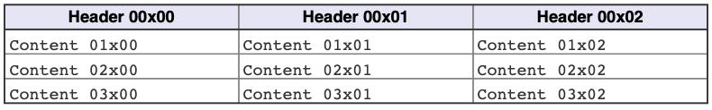
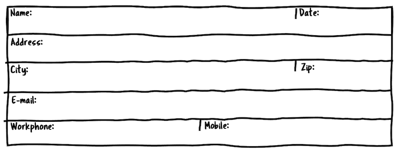
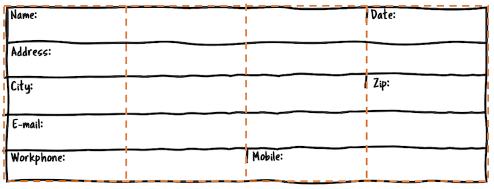
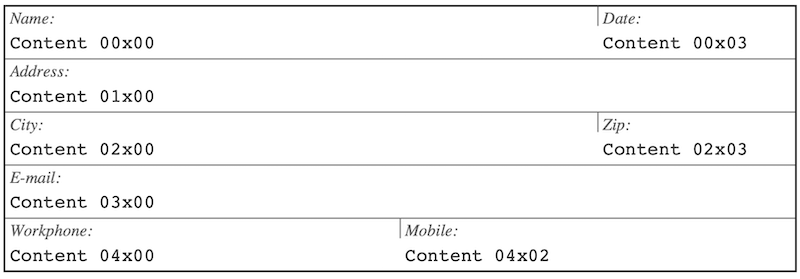
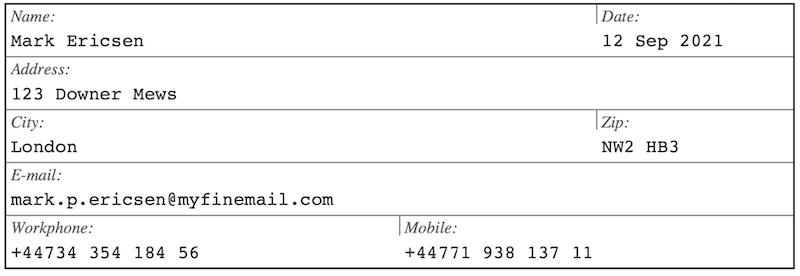

# Tables layout from data

So far we have constructed the layout of table by issuing API calls per table to set up, for example,  the column widths and what cells should merge with what other cells and so on. Previously we saw that data to be put in the table could be specified by either directly issuing API calls per cell, using a 2D array that we populate with data and then finally use callbacks to generate the data in the cells.

The final and most powerful way of constructing a table is to define the table structure as data. This *structural data* together with a style theme can completely define a table.

This will allow the dynamic construction of tables with only one API call instead of the multiple call required to construct a table the usual way. It can initially seem more complex but for advanced table this is indeed a much simpler and easy to maintain. In fact, this will allow a table to bed defined entirely in a database and makes it possible to adjust tha table as the data changes without ever updating the code (or recompile).

## Defining a table in data

There are two data structure that are used when defining a table. First there is a data structure for the overall table specifics and then in that structure a structure to specify the layout of each cell. In addition, a theme needs to be defined (see section on @ref sec_themes "Themes"). It is possible to omit the theme by specifying `NULL` in which case the default theme will be used.

To stroke a table from data the following API call is used

```c
int
hpdftbl_stroke_from_data(HPDF_Doc pdf_doc, HPDF_Page pdf_page, hpdftbl_spec_t tbl_spec, hpdftbl_theme_t *theme);
```

In order to populate the table with suitable data callback functions are used (as described in section )

The overall table is first defined as an instance of

```c
typedef struct hpdftbl_spec {
    /** Table title */
    char *title;
    /** Use a header for the table */
    _Bool use_header;
    /** Use labels in table */
    _Bool use_labels;
    /** Use label grid in table */
    _Bool use_labelgrid;
    /** Number of rows in the table */
    size_t rows;
    /** Number of columns in the table */
    size_t cols;
    /** X-position for table */
    HPDF_REAL xpos;
    /** Y-position for table */
    HPDF_REAL ypos;
    /** Width of table */
    HPDF_REAL width;
    /** Height of table */
    HPDF_REAL height;
    /** Content callback for this table */
    hpdftbl_content_callback_t content_cb;
    /** Label callback for this table */
    hpdftbl_content_callback_t label_cb;
    /** Content style callback for table */
    hpdftbl_content_style_callback_t style_cb;
     /** Post table creation callback. This is an opportunity for a client to do any special
     * table manipulation before the table is stroked to the page. A reference to the table
     * will be passed on in the callback.
     */
    hpdftbl_callback_t post_cb;
    /** Array of cell specification */
    hpdftbl_cell_spec_t *cell_spec;
} hpdftbl_spec_t;
```

Then each cell (referenced above in the `cell_spec` field) is defined as an instance of

```c
typedef struct hpdftbl_cell_spec {
    /** Row for specified cell */
    size_t row;
    /** Row for specified cell*/
    size_t col;
    /** Number of rows the specified cell should span */
    unsigned rowspan;
    /** Number of columns the specified cell should span */
    unsigned colspan;
    /** The label for this cell */
    char *label;
    /** Content callback for this cell */
    hpdftbl_content_callback_t content_cb;
    /** Label callback for this cell */
    hpdftbl_content_callback_t label_cb;
    /**  Content style callback for this cell */
    hpdftbl_content_style_callback_t style_cb;
    /**  Canvas callback for this cell */
    hpdftbl_canvas_callback_t canvas_cb;
} hpdftbl_cell_spec_t;
```


## A first example of defining table as data

To understand how this is done lets start to define a basic 3x3 table with header row (so 4x3 in total) as data. First we create an instance of the table data

```c
hpdftbl_spec_t tbl_spec = {
        // Title and header flag
        .title=NULL, .use_header=TRUE,

        // Label and labelgrid flags
        .use_labels=FALSE, .use_labelgrid=FALSE,

        // Row and columns
        .rows=4, .cols=3,

        // Position of the table, xpos and ypos
        .xpos=hpdftbl_cm2dpi(1), .ypos=hpdftbl_cm2dpi(A4PAGE_HEIGHT_CM-2),

        // width and height
        .width=hpdftbl_cm2dpi(15), .height=0,

        // Content and label callback
        .content_cb=cb_content, .label_cb=cb_label,

        // Style and table post creation callback
        .style_cb=NULL, .post_cb=NULL,

        // Pointer to optional cell specifications
        .cell_spec=NULL
};
```

@note In the table definition we use the C99 feature of specifying the field name when defining data in a structure.

Then the actual API call is trivial compared to the table creation code we have seen in the previous examples 
and consists of only one line of code

```c
void
create_table_ex13_1(HPDF_Doc pdf_doc, HPDF_Page pdf_page) {
   hpdftbl_stroke_from_data(pdf_doc, pdf_page, &tbl_spec, NULL);
}
```

The result is as expected and shown in **Figure 13** but with much less code!

  
***Figure 13:*** *Defining a table with a data structure @ref tut_ex13_1.c "tut_ex13_1.c"*


## A second example of defining a table as data

In the previous example we kept it simple didn't specify any format or content fór a table cell. Let us 
therefore create a slightly more complex example where we create a form which easily could be used to display data 
records from a DB.

The nice thing about separating layout and table structure from the data population in the callbacks is that this
can almost be seen as a poor man's model-view-controller where the table structure is completely separate from the
data (and how it is created).

A good way to start designing a table is to make a sketch on how it should look. Our goal is to crete the table structure as shown in the empty table in **Figure 14** below

  
***Figure 14:*** *Sketch of table to be designed*

To get this layout we use a basic table with :

1. Five rows and four columns
2. No header and no title
3. We use labels and label grids

To make it easier to see how to construct the table we can overlay the sketch with a grid shown in blue in **Figure 15**. 
As can be seen this is a basic 5x4 table where a number of cells span multiple columns.


  
***Figure 15:*** *Sketch of table to be designed with 5x4 table overlaid*

To start we set up the table specification as in the previous example with necessary changes. 
We will also need to specify cell specifications this time, and we assume those are available in an array of cell structures called `cell_specs`.

Before we specify the table structure we have one design decision to make. For the callbacks we can either use the table callback for all cells and check row and column to get the appropriate data, or we can add individual callbacks for each cell. The first case has the advantage to only need one callback function (but a lot of tests) and the second that each callback will be small and focused to get the data for that individual cell, but we will need potentially one callback for each cell unless there are commonalities between the cells so one callback can serve multiple cells. Remember that we still get the row and column as arguments in the callback so we weill always know exactly for which cell the callback was made.

To keep the size of this example we will use the table callback method for content and specify the label directly in the cell specification. With this decision made we get the following definition cell specifications

```c
hpdftbl_cell_spec_t cell_specs[] = {
        {.row=0, .col=0, .rowspan=1, .colspan=3,
         .label="Name:",
         .content_cb=NULL, .label_cb=NULL, .style_cb=NULL, .canvas_cb=NULL},
        {.row=0, .col=3, .rowspan=1, .colspan=1,
         .label="Date:",
         .content_cb=NULL, .label_cb=NULL, .style_cb=NULL, .canvas_cb=NULL},
        {.row=1, .col=0, .rowspan=1, .colspan=4,
         .label="Address:",
         .content_cb=NULL, .label_cb=NULL, .style_cb=NULL, .canvas_cb=NULL},
        {.row=2, .col=0, .rowspan=1, .colspan=3,
         .label="City:",
         .content_cb=NULL, .label_cb=NULL, .style_cb=NULL, .canvas_cb=NULL},
        {.row=2, .col=3, .rowspan=1, .colspan=1,
         .label="Zip:",
         .content_cb=NULL, .label_cb=NULL, .style_cb=NULL, .canvas_cb=NULL},
        {.row=3, .col=0, .rowspan=1, .colspan=4,
         .label="E-mail:",
         .content_cb=NULL, .label_cb=NULL, .style_cb=NULL, .canvas_cb=NULL},
        {.row=4, .col=0, .rowspan=1, .colspan=2,
         .label="Work-phone:",
         .content_cb=NULL, .label_cb=NULL, .style_cb=NULL, .canvas_cb=NULL},
        {.row=4, .col=2, .rowspan=1, .colspan=2,
         .label="Mobile:",
         .content_cb=NULL, .label_cb=NULL, .style_cb=NULL, .canvas_cb=NULL},
         HPDFTBL_END_CELLSPECS // Sentinel to mark the end of
};
```

As can be seen we need to have an end of cell specification sentinel since we could decide to provide details for one or more cells and there is no way for the library to know how many fields to read otherwise.  There is even a convenience constant in the library `PDFTBL_END_CELLSPECS` that can be used as the last record.

The overall table specification is pretty much as before but with the added cell specifications.


```c

hpdftbl_spec_t tbl_spec = {
        // Title and header flag
        .title=NULL, .use_header=FALSE,

        // Label and labelgrid flags
        .use_labels=TRUE, .use_labelgrid=TRUE,

        // Row and columns
        .rows=5, .cols=4,

        // xpos and ypos
        .xpos=hpdftbl_cm2dpi(1), .ypos=hpdftbl_cm2dpi(A4PAGE_HEIGHT_CM-2),

        // width and height
        .width=hpdftbl_cm2dpi(15), .height=0,

        // Content and label callback
        .content_cb=cb_content, .label_cb=cb_label,

        // Style and table post creation callback
        .style_cb=NULL, .post_cb=NULL,

        // Pointer to optional cell specifications
        .cell_spec=cell_specs
};
```

When this is run (see @ref tut_ex13_2.c "tut_ex13_2.c") it generates the following image, **Figure 13.2**

  
***Figure 16:*** *Specifying a table as data with cell specifications.*

What remains is to write the proper table content callback that will populate the table. In a real life scenario his data will most likely come from a database but adding that in our example would bring too far. Instead, we will just use some fake static dummy data to illustrate the principle.

Since we have one callback for all cells we need to test from which cell the call come from. Here is a very important point to make. **The row and column number will be the row and cell columns in the original table before any column or row spans was applied.** In this example it means that for example the "Date" field (upper right) will have `row=0` and `col=3` and **not** `(0,1)`!!.

With this information we can write the following (dummy) table callback

```c
static char *
cb_content(void *tag, size_t r, size_t c) {
    static char *cell_content[] =
            {"Mark Ericsen",
             "12 Sep 2021",
             "123 Downer Mews",
             "London", 
             "NW2 HB3",
             "mark.p.ericsen@myfinemail.com",
             "+44734 354 184 56",
             "+44771 938 137 11"};

    if( 0==r && 0==c) return cell_content[0];
    else if (0==r && 3==c) return cell_content[1];
    else if (1==r && 0==c) return cell_content[2];
    else if (2==r && 0==c) return cell_content[3];
    else if (2==r && 3==c) return cell_content[4];
    else if (3==r && 0==c) return cell_content[5];
    else if (4==r && 0==c) return cell_content[6];
    else if (4==r && 2==c) return cell_content[7];
    else return NULL;
}
```

and we get the (expected) result as shown in **Figure 17** below.

  
***Figure 17:*** *Specifying a table as data with cell specifications and "dummy" data.*

The alternative of specifying individual callback for each cell would then require that each cell have a callback provided or perhaps even a mix with both a general table callback and selected cell callbacks.

The priority is such that a cell callback will always override a table callback. In the above example the callback for the name field could as an example be

```c
static char *
cb_content_name(void *tag, size_t r, size_t c) {
     static char *cell_content = "Mark Ericsen";
     return cell_content;
}
```


